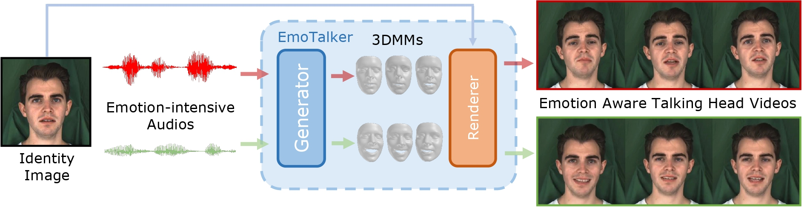

# EmoTalker

<a href='https://emotalker.s3.amazonaws.com/index.html'></a>



<div style="display: flex; flex-direction: row;">
  <div style="flex: 1;">
    <a href='https://emotalker.s3.amazonaws.com/index.html'>
  </div>
</div>

## Train

```
# face branch stage 1
python train_vq.py --batch_size 512 --depth 4 --down_t 2 --face_codebook_size 256 --lip_codebook_size 512 --face_code_dim 128 --lip_code_dim 64
# face branch stage 2
python tran_face.py --n_head 4 --num_layers 6 --contra 1.0
# lip branch
python train_lip.py --lip_mix 0.8
```

## Evaluation

```
python eval.py --test_path TEST_PATH
```
